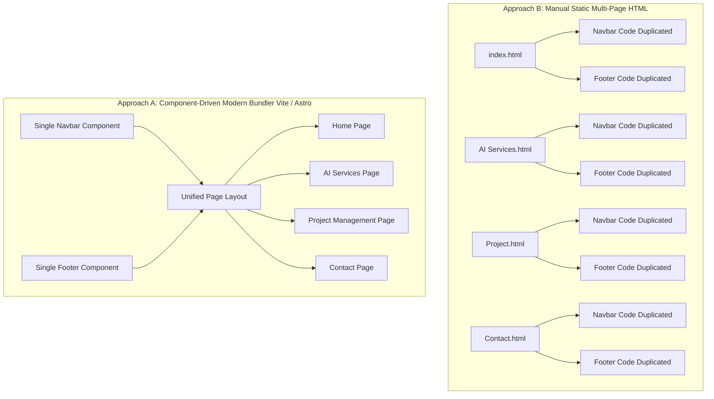
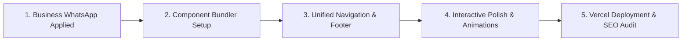

# ProjectAI — Website Architecture & Strategy Documentation

Comprehensive technical documentation, architectural comparisons, design standards, and implementation guides for building and scaling the 4-page corporate website for **ProjectAI LLP**.

---

## 1. Project Overview

The website is a high-converting, enterprise-grade multi-page corporate platform designed for an AI consulting and project management firm.

### Core 4 Pages
1. **Home (`index.html`)**: High-impact value proposition, live telemetry counters, core service pillars, enterprise proof, and consultation CTA.
2. **AI Services (`AI Services.html`)**: Service catalog (LLM fine-tuning, automated workflows, predictive analytics, computer vision), technical architectures, and engagement tiers.
3. **Project Management (`Project.html`)**: Enterprise agile delivery lifecycle, interactive milestone timelines, governance/security badges (PMP, ISO, SOC2), and client portal mockups.
4. **Contact & Consultation (`Contact.html`)**: Scope inquiry form, direct Singapore office details, integrated **WhatsApp Business** direct channels, and floating quick-action chat widget.

---

## 2. Architecture Comparison: Approach A vs. Approach B

### Architectural Flowchart

---

### Detailed Comparison Matrix

| Evaluation Criteria | Approach B: Static Multi-Page HTML | Approach A: Modern Bundler (Vite / Astro) | Why Approach A is Superior |
| :--- | :--- | :--- | :--- |
| **1. Maintainability (DRY Principle)** | Navbars, footers, scripts, and fonts are manually copied across all 4 `.html` files. | Header, Navigation, and Footer exist as **single shared components**. | Updating a phone number, logo, or navigation item requires editing **1 file**, not 4. Eliminates human error and broken links. |
| **2. Clean & Professional URLs** | URLs contain file extensions and spaces: `/AI%20Services.html`, `/Contact.html`. | Clean, modern URL routing: `/ai-services`, `/project-management`, `/contact`. | Clean URLs are standard for enterprise websites, look trustworthy to clients, and boost search engine indexing. |
| **3. Page Speed & Lighthouse Score** | Relies on client-side Tailwind CDN (`cdn.tailwindcss.com`) which compiles classes in the visitor's browser. | Compiles and purges CSS at build time into minified, lightweight `.css` files (~15KB). | **3x faster initial load (FCP)**, zero client-side styling layout shifts (CLS), and 100/100 Google Lighthouse scores. |
| **4. Cache Invalidation & Versioning** | Browsers cache old CSS/JS files, requiring visitors to hard-refresh (`Ctrl+F5`) to see updates. | Automatically appends content hashes to assets (`app.a1b2c3.js`, `main.9d8e7f.css`). | Continuous deployments on Vercel immediately invalidate cache so every visitor sees the latest changes instantly. |
| **5. Developer Experience (DX)** | Requires manual browser refreshes on every edit. | **Hot Module Replacement (HMR)**: Changes update in milliseconds without losing page state. | Accelerates development speed and interactive polish with Antigravity. |
| **6. Scalability** | Adding a 5th page (e.g., *Case Studies*, *Careers*, *Insights*) requires cloning boilerplate HTML. | New pages are created in seconds using layout inheritance. | Scales effortlessly as the consulting agency introduces new service lines. |

---

## 3. Vercel Deployment Compatibility

### Does Approach A have any issues deploying to Vercel?
**No. Vercel provides native, zero-configuration support for Approach A:**
- **Auto-Detection**: Vercel inspects the repository, recognizes `vite` or `astro`, and automatically sets the build command (`npm run build`) and output directory (`dist`).
- **Global Edge Network**: Assets are cached and served from over 100 edge nodes globally for sub-100ms response times.
- **Automated Preview Environments**: Every Git pull request or branch creates an isolated preview URL with automated SSL certificates.
- **Static Support**: Even if starting with static HTML files, Vercel deploys static folders instantly without extra configuration.

---

## 4. Design System & Aesthetics (Enterprise Futurist)

Anchored in [DESIGN.md](file:///home/mille/TFYProject/ProjectAI_Website/DESIGN.md) and [SKILL.md](file:///home/mille/TFYProject/ProjectAI_Website/SKILL.md):

### Color Tokens
- **Background / Canvas (Deep Midnight):** `#0F172A` / `#101415`
- **Primary Accent (Vibrant Cyan):** `#22D3EE` / `#00CBE6`
- **Surface Elevation (Tonal Cards):** `#1E293B` with `1px border: rgba(51, 65, 85, 0.5)`
- **Secondary Slate:** `#64748B` / `#94A3B8`
- **Primary Text:** `#F8FAFC` / `#E0E3E5`

### Typography & Spacing
- **Primary Font:** `Inter` (High legibility, tight tracking on headings `-0.02em`).
- **Monospace Accent Font:** `JetBrains Mono` (Used for data tags, metrics, and live badges).
- **8pt Spatial Rhythm:** All margins, paddings, and gaps adhere to multiples of 8px (`16px`, `24px`, `32px`, `48px`, `64px`, `120px`).

---

## 5. Contact & WhatsApp Business Integration

[Contact.html](file:///home/mille/TFYProject/ProjectAI_Website/Contact.html) features two dedicated WhatsApp Business touchpoints:

1. **Left-Column WhatsApp Business Card**:
   - Live online status indicator with pulsing green dot.
   - Pre-filled inquiry URL deep-linking to `https://wa.me/6589076453`.
   - Hover illumination matching the enterprise glassmorphic aesthetic.
2. **Floating Quick-Action Chat Button**:
   - Fixed at `bottom-6 right-6` with active glow.
   - Expanding label on hover (*"Chat with us"*) for high mobile and desktop conversion rates.

---

## 6. Implementation Roadmap

- **Step 1:** Apply Business WhatsApp and fix internal navigation links in `Contact.html` *(Completed)*.
- **Step 2:** Set up Approach A build infrastructure (Vite / Astro + Tailwind build system + `vercel.json`).
- **Step 3:** Centralize reusable components (`Navbar`, `Footer`, `WhatsAppWidget`, `Layout`).
- **Step 4:** Add interactive enhancements (scroll reveals, metric counters, form validation toast).
- **Step 5:** Perform cross-breakpoint validation (Mobile `375px`, Tablet `768px`, Desktop `1440px`) and deploy to Vercel.
